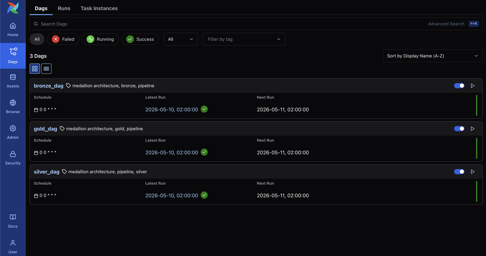
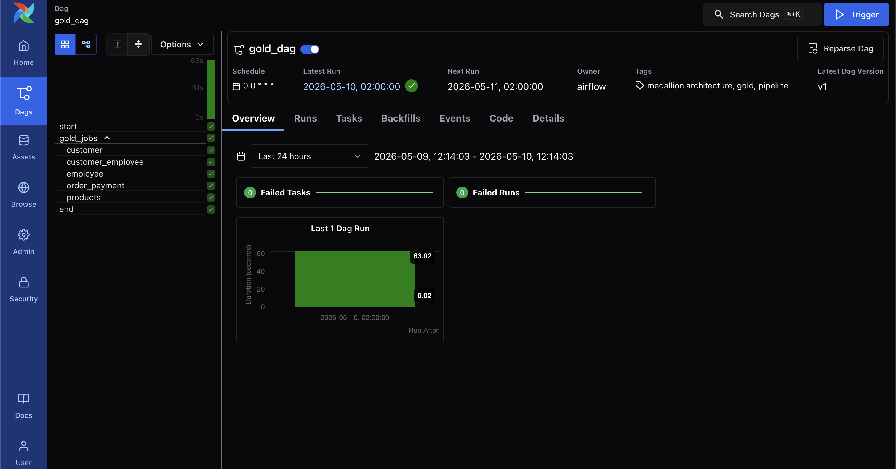
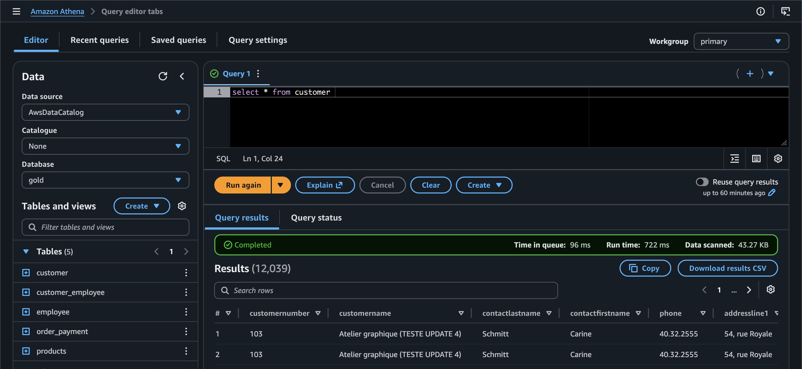
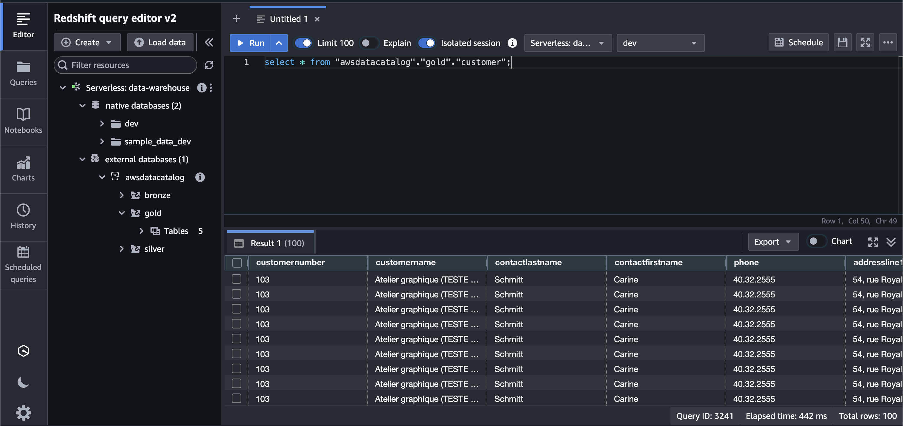

# Classic Models Pipeline Documentation

## Overview
This project implements a medallion data architecture with three layers:
- **Bronze**: daily ingestion of source tables
- **Silver**: transformation into standardized and historical models
- **Gold**: consolidated analytical tables with aggregations and joins from `silver`

Airflow DAGs orchestrate each layer:
- `dags/dag_bronze.py`
- `dags/dag_silver.py`
- `dags/dag_gold.py`

## Medallion architecture

### Bronze
The Bronze layer reads source data and writes it to S3. The bronze DAG creates a task per table using `src/medallion_architecture/bronze.py`.

### Silver
The Silver layer transforms Bronze data into a consistent format and applies SCD strategies when needed. Silver tables are generated with `src/medallion_architecture/silver.py` and configured in `src/config/silver/silver_config.py`.

### Gold
The Gold layer is built from Silver tables. It rebuilds analytical tables using queries defined in `src/config/gold/gold_config.py` and the creation logic in `src/medallion_architecture/gold.py`.

## How the Gold layer works

The `gold` layer always reads data from the `silver` layer.
- `gold` does not read directly from `bronze`.
- Each run of the `gold_dag` recreates gold tables from the current silver tables.
- Therefore, gold reflects the latest data present in silver at execution time.

The currently configured gold tables are:
- `customer`
- `employee`
- `customer_employee`
- `order_payment`
- `products`

## Data access
The data can be analyzed by BI tools, and these datasets can be viewed via **Athena or Redshift**.

## Project structure

- `dags/` - Airflow DAGs
- `src/` - Python pipeline code
  - `src/medallion_architecture/` - Bronze/Silver/Gold logic
  - `src/config/` - table and transformation configurations
- `img/` - images used in documentation
- `docker-compose.yaml` - local Airflow environment
- `dockerfile` - container image definition
- `requirements.txt` - Python dependencies

## Notes

- The gold layer depends on the current state of silver.
- If silver is updated, gold will also be updated at runtime.
- The pipeline does not do incremental gold updates; it recreates gold tables each execution.